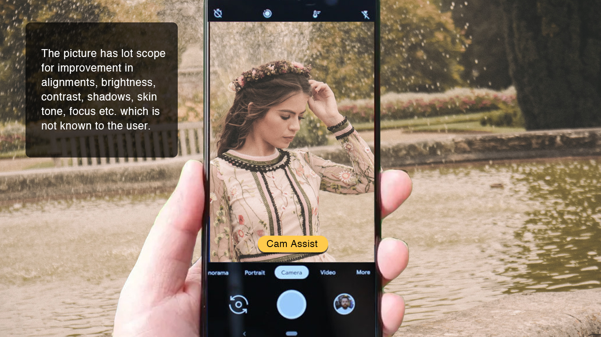

#AndroidDevChallenge

# Camera Assistant

#### The idea
Camera assistant where you can pan the camera a bit (movement of around 2 inches wide) which will capture multiple frames and gives you 3 best pics with corrections (filters, colour corrections, crop, alignment etc.) to choose from. You can re-visit the original photo and use it as horizontal frame (full width) if needed.

#### What are we solving here?
Imagine someone with difficulties getting a good frame, alignments, colour filters etc right with one shot. People take multiple pictures before they zero in on one good picture. Camera Assistant will solve this with a single click where our on-device ML model which has been trained with millions of pictures taken by professional photgraphers across different locations, seasons and perspectives will help in composing the best picture with corrections so that you don't have to do it manually. This removes the anxiety people have when they are short of time at a picturesque location, but want the best frames. The app takes a wider angle photo which can be manipulated later manually as well.

#### Picture this!
Usually when we ask a stranger to click a picture, they take a picture with their own understanding of how the picture should look and there is no scope for improvements. What if you ask them to use Camera Assist and follow the instructions? Everytime you can go back to the original picture and compose the way you want it!

## App flow

***Step 1: Open the camera app and tap on Camera Assistant button***

***Step 2: As per the animated instruction just pan the camera for about 2 inches horizontally from left to right while placing the subject in the centre.***

***Step 3: The app will process (using ML) the taken image and show 3 corrected images (by applying filters, colour corrections, crop, alignment etc.) and will also show you comparison of the original image without applying any changes/filters.***

# Bringing it to life

### Where we are now :
We are just an idea at this moment, but we have a clear picture of how we can bring it to life.

### Our Approach:

1. Stiching the multiple images from panning to make a larger image.
2. Matching each portion of the image with millions of image from which model has been trained on.
3. Taking the top 3 best matching images.
4. Adjusting the image (like cropping, rotating etc) & applying the perfect settings (like brightness, contrast etc).

### How Google can help us :

* Help us with the required images and resources (like cloud) to train the model.
* Computer Vision Expert as a mentor would be really helpful.

### Timeline :

#### In December 2019:
* Studying and building the dataset.

#### In January 2020:
* Analyzing and Preparing the ML model.
* Developing and Testing the Android App.

#### In February & March 2020 :
* Training and Testing the model.

#### In April 2020:
* Testing the final output in real environment.

# About us

We are a software company called [Flashbox](http://flashbox.in/)  in Bengaluru, India helping large enterprises build products. We also are developing an app called [5Things](https://play.google.com/store/apps/details?id=com.flashbox.a5things) which shows you content (News, Restaurants, movies, weather, sports scores, stock market updates, trivia etc based on demography and location). At a time we show only 5Things. Right now we are in beta, we will be releasing the app within a couple months.
